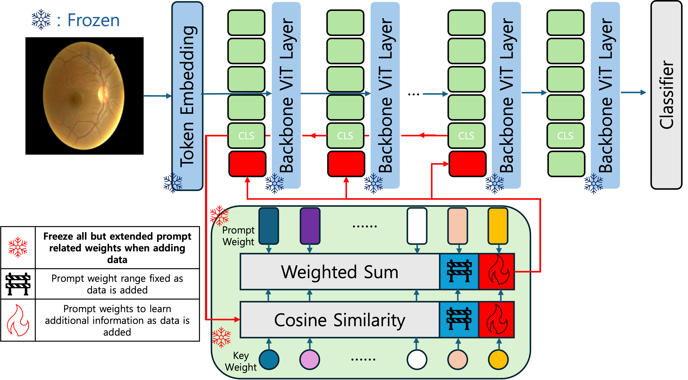
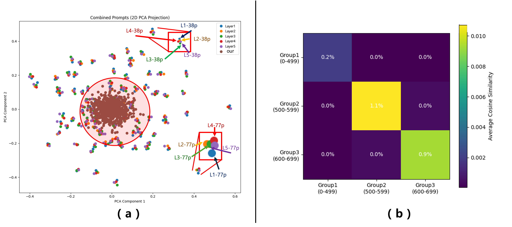

# UniPrompt-CL: Unified Prompt Pool for Continual Learning

Official PyTorch implementation of **UniPrompt-CL**, a framework with a **Unified Prompt Pool** designed for continual learning (CL) in the medical domain.  
This work has been submitted to **ECCV 2026**.

---

## Table of Contents
- [Overview](#-overview)
- [Key Contributions](#-key-contributions)
- [Architecture Overview](#-architecture-overview)
- [Setup](#-setup)
- [Data Preparation](#-data-preparation)
- [Training](#-training)
- [Results](#-results)
- [Reproducibility](#-reproducibility)
- [Citation](#-citation)
- [License](#-license)

---

## 📖 Overview

While state-of-the-art models achieve strong performance on large-scale natural image datasets, medical AI faces distinct challenges:

- 📌 Privacy and ethical constraints → centralized training is often infeasible
- 📌 Domain shift → caused by device heterogeneity and demographic/hospital differences
- 📌 Catastrophic forgetting → knowledge erasure in sequential learning

To address these issues, UniPrompt-CL introduces:
- 🔹 Unified Prompt Pool: integrates prompts across layers into a single pool, reducing redundancy
- 🔹 Minimal Prompt Expansion: adds only a small set of prompts to adapt to new domains
- 🔹 Stabilizing regularization: ensures stable training and prevents prompt overlap
- 🔹 DINOv2-base backbone (~86.6M parameters): balances expressiveness and efficiency

## 💡 Why General PCL Fails and Why We Need Medical-domain Prompt-based CL

- **Data constraints & privacy issues**  
  Medical data cannot be freely shared due to strict ethical and legal restrictions. Hospitals must train models locally, and rehearsal-based methods that store or reuse past data are infeasible under such privacy-sensitive conditions.

- **Specific characteristics of medical imaging**  
  Unlike natural images, medical images are collected under standardized acquisition protocols, which means that diverse viewpoints and compositions rarely occur. Instead, distribution shifts mainly arise from patient-specific physiological variations (e.g., subtle color/texture changes) and inter-hospital or inter-device discrepancies. Therefore, rather than broadly covering general features as in natural image prompts, domain-tailored prompts capable of capturing fine-grained patterns such as vessel and nerve structures are required.

- **Limitations of existing CL approaches**  
  Regularization, architecture, and rehearsal-based methods are not well-suited to the medical domain due to complexity, resource demands, and privacy concerns. Furthermore, existing PCL methods originally designed for natural images often degrade in performance on medical datasets and incur unnecessary computational costs (e.g., multiple ViT inferences).

- **Necessity of medical-domain PCL**  
By combining a fixed backbone (e.g., ViT, DINOv2) with lightweight prompt learning, models can preserve prior knowledge while adapting efficiently to new domains. Such domain-specific prompts effectively mitigate catastrophic forgetting, capture fine-grained clinical variations, and provide a privacy-friendly and practical CL strategy for real-world medical AI.


## 🚀 Key Contributions
- We highlight the need for a medical-domain-specific PCL method and, accordingly, propose the following contributions.
1. Unified Prompt Pool  
   - Consolidates per-layer prompts into a unified pool  
   - Enhances fine-grained and stable feature representation

2. Few Prompt Expansion  
   - Expands the pool with only 20% new prompts per stage  
   - Maintains efficiency while enabling new knowledge acquisition

3. Lightweight yet strong performance  
   - Improves accuracy by +10% and F1 by +9 points over baselines  
   - Achieves results with a single ViT inference (vs. dual inference in prior work)  
   - Reduces FLOPs by approximately 30%


---

## 🧩 Architecture Overview

<figure>
  
  <figcaption><b>Figure 1.</b> This figure presents the overall architecture proposed in this study, which integrates an enhanced prompt pool. At each layer, the [CLS] token serves as a query, and the resulting layer-wise queries are centrally managed through the prompt pool integration module. This integration generates the prompts for the subsequent layer, which are then combined with x_l and propagated forward. Additionally, at each training stage, only a small number of new prompts are introduced through a minimal prompt expansion mechanism, while all previously learned prompts remain frozen.</figcaption>
</figure>

<figure>
  
  <figcaption><b>Figure 2.</b> To support our claim, we visualized representative examples from the natural images used in prior PCL methods and the medical datasets employed in this study.</figcaption>
</figure>

<figure>
  
  <figcaption><b>Figure 3.</b> (a) visualizes the prompts learned by the independent prompt pool of OS-Prompt and those produced by our proposed integrated pool. The dots corresponding to layers 1–5 represent the layer-wise prompts of OS-Prompt, whereas the brown dots (Ours) denote the prompts generated by our integrated pool. (b) further shows that, as training progresses, newly added prompts avoid redundant or overlapping representations, indicating that each prompt captures distinct and complementary features.</figcaption>
</figure>

---

## 🛠 Setup

- Python 3.8
- PyTorch 2.4.1 + CUDA 11.8
- NVIDIA V100 × 2 (≈8GB VRAM per experiment)

Recommended installation:

```bash
pip3 install -r requirements.txt  
```

---

## 🗂 Data Preparation

Datasets:
- [APTOS 2019 Blindness Detection](https://kaggle.com/competitions/aptos2019-blindness-detection)
- [DDR](https://github.com/nkicsl/DDR-dataset)
- [DRD](https://kaggle.com/competitions/diabetic-retinopathy-detection)

Files requiring path configuration:
- `./dataloader/atop_dataloader.py`
- `./dataloader/DDR_dataloader.py`
- `./run_train.sh`

Fill in local dataset paths where indicated in the code comments.  
CSV samples are provided under `dataloader/`.

---

## 🎯 Training

1) Configure dataset paths  
2) Start training via script:

```bash
bash run_train.sh
```

Key directories:
- `train/train.py`, `train/ddp_train.py`: training loop
- `network/model.py`, `network/loss.py`: model and loss functions
- `util/early_stopping.py`, `util/scheduler.py`, `util/utils.py`: utilities

---

## 📊 Results
Explanations for each table are provided in detail in the paper!
If any part is unclear, please refer to the paper for further descriptions.
Thank you.

### 🔹 Table 1. Final Accuracy (Acc) and F1-Score (F1) Results After the Final Stage and Performance Comparison with Other PCL Models. The symbol † denotes our proposed model. PCL: prompt-based continual learning; Arch-CL: architecture-based; Reh-CL: rehearsal-based; Reg-CL: regularization-based. (**Bold** = highest; scores are mean values with negligible deviations.)

| CL-Type (Ref) | Model | APTOS (Acc / F1) | DDR (Acc / F1) | DRD (Acc / F1) |
|---------------|-------|------------------|----------------|----------------|
| PCL (ECCV2024) | OS | 0.687 / 0.637 | 0.693 / 0.648 | 0.619 / 0.568 |
| PCL (ECCV2024) | OS++ | 0.743 / 0.686 | 0.697 / 0.655 | 0.623 / 0.565 |
| Arch-CL (CVPR2024) | MoE-Adapters | 0.835 / 0.742 | 0.747 / 0.694 | 0.564 / 0.478 |
| PCL (CVPR2023) | Coda-Prompt | 0.682 / 0.646 | 0.721 / 0.697 | 0.663 / 0.557 |
| PCL (CVPR2022) | L2P | 0.353 / 0.174 | 0.421 / 0.194 | 0.603 / 0.252 |
| PCL (ECCV2022) | Dual-prompt | 0.363 / 0.185 | 0.435 / 0.222 | 0.604 / 0.259 |
| Reh-CL (NIPS2020) | DER++ | 0.531 / 0.442 | 0.609 / 0.567 | 0.681 / 0.612 |
| Reg-CL (ICML2018) | Online EWC | 0.746 / 0.695 | 0.702 / 0.708 | 0.698 / 0.653 |
| — | **UniPrompt-CL †** | **0.849 / 0.761** | **0.772 / 0.723** | **0.701 / 0.656** |

---

### 🔹 Table 2. Tracking and comparing various catastrophic forgetting outcomes during stage progression (Red: current step data, Blue: previously learned (seen), Black: unseen). [Acc, F1; OS++; **Horizontal: Training Data, Vertical: Evaluation Data**]. FLOPs row = computing resources. The symbol † denotes our proposed model.

<table>
  <thead>
    <tr>
      <th rowspan="2">Training</th>
      <th rowspan="2">Dataset</th>
      <th colspan="6">OS-Prompt++ (Dual inference)</th>
      <th colspan="6">UniPrompt-CL (Single inference)</th>
    </tr>
    <tr>
      <th colspan="2">APTOS</th>
      <th colspan="2">DDR</th>
      <th colspan="2">DRD</th>
      <th colspan="2">APTOS</th>
      <th colspan="2">DDR</th>
      <th colspan="2">DRD</th>
    </tr>
    <tr>
      <th></th>
      <th></th>
      <th>Acc</th><th>F1</th>
      <th>Acc</th><th>F1</th>
      <th>Acc</th><th>F1</th>
      <th>Acc</th><th>F1</th>
      <th>Acc</th><th>F1</th>
      <th>Acc</th><th>F1</th>
    </tr>
  </thead>
  <tbody>
    <tr>
      <td>Stage 1</td><td>APTOS</td>
      <td><span style="color:#d62728;">0.868</span></td><td><span style="color:#d62728;">0.753</span></td>
      <td>0.565</td><td>0.474</td>
      <td>0.409</td><td>0.354</td>
      <td><span style="color:#d62728;">0.901</span></td><td><span style="color:#d62728;">0.767</span></td>
      <td>0.601</td><td>0.447</td>
      <td>0.453</td><td>0.381</td>
    </tr>
    <tr>
      <td>Stage 2</td><td>DDR</td>
      <td><span style="color:#1f77b4;">0.707</span></td><td><span style="color:#1f77b4;">0.638</span></td>
      <td><span style="color:#d62728;">0.797</span></td><td><span style="color:#d62728;">0.748</span></td>
      <td>0.508</td><td>0.413</td>
      <td><span style="color:#1f77b4;">0.866</span></td><td><span style="color:#1f77b4;">0.663</span></td>
      <td><span style="color:#d62728;">0.878</span></td><td><span style="color:#d62728;">0.844</span></td>
      <td>0.636</td><td>0.534</td>
    </tr>
    <tr>
      <td>Stage 3</td><td>DRD</td>
      <td><span style="color:#1f77b4;">0.743</span></td><td><span style="color:#1f77b4;">0.686</span></td>
      <td><span style="color:#1f77b4;">0.697</span></td><td><span style="color:#1f77b4;">0.655</span></td>
      <td><span style="color:#d62728;">0.623</span></td><td><span style="color:#d62728;">0.565</span></td>
      <td><span style="color:#1f77b4;">0.849</span></td><td><span style="color:#1f77b4;">0.761</span></td>
      <td><span style="color:#1f77b4;">0.772</span></td><td><span style="color:#1f77b4;">0.723</span></td>
      <td><span style="color:#d62728;">0.701</span></td><td><span style="color:#d62728;">0.656</span></td>
    </tr>
  </tbody>
  <tfoot>
    <tr>
      <th colspan="2">FLOPs</th>
      <td colspan="6">66.42 GFLOPs</td>
      <td colspan="6">44.17 GFLOPs</td>
    </tr>
  </tfoot>
</table>

---

### 🔹 Table 3. Performance evaluation of AvgACC, BWT, and Cost-Adjusted Retained Accuracy (CARA) across three diabetic retinopathy datasets. Training-time GFLOPs (per step, including forward and backward passes). The symbol † denotes our proposed model. Best results in **bold**.

| Method | AvgACC ↑ | BWT ↑ | AvgF ↓ | GFLOPs ↓ | CARA₀.₅ ↑ |
|--------|----------|-------|--------|----------|------------|
| OS-Prompt | 0.666 | −0.132 | 0.132 | **34.26** | 0.098 |
| MoE-Adapters | 0.716 | −0.080 | 0.080 | 105.64 | 0.064 |
| Coda-Prompt | 0.688 | −0.140 | 0.140 | 134.33 | 0.051 |
| L2P | 0.459 | −0.296 | 0.296 | 116.93 | 0.029 |
| Dual-prompt | 0.467 | −0.291 | 0.291 | 105.05 | 0.032 |
| DER++ | 0.607 | −0.288 | 0.288 | 168.02 | 0.033 |
| Online EWC | 0.715 | −0.174 | 0.174 | 100.62 | 0.059 |
| OS-Prompt++ (Original) | 0.769 | −0.113 | 0.113 | 51.12 | 0.095 |
| OS-Prompt++ (Add Dino-v2) | 0.812 | −0.125 | 0.125 | 66.42 | 0.087 |
| **UniPrompt-CL †** | **0.849** | **−0.079** | **0.079** | 44.17 | **0.116** |

---

### 🔹 Table 4. Performance evaluation of AvgACC and BWT across three small external skin cancer datasets. The symbol † denotes our proposed model.

| Model | AvgACC ↑ | BWT ↑ | AvgF ↓ | GFLOPs ↓ | CARA₀.₅ ↑ |
|-------|----------|-------|--------|----------|------------|
| OS | 0.682 | −0.135 | 0.135 | **34.26** | 0.101 |
| OS++ | 0.725 | −0.063 | 0.063 | 51.12 | 0.095 |
| MoE-Adapters | 0.597 | −0.040 | 0.040 | 105.64 | 0.056 |
| Coda-Prompt | 0.713 | −0.041 | 0.041 | 134.33 | 0.059 |
| Dual-prompt | 0.637 | **−0.012** | **0.012** | 105.05 | 0.061 |
| DER++ | 0.722 | −0.099 | 0.099 | 168.02 | 0.050 |
| Online EWC | 0.708 | −0.157 | 0.157 | 100.62 | 0.060 |
| **UniPrompt-CL †** | **0.732** | −0.049 | 0.049 | 44.17 | **0.105** |

---

### 🔹 Table 5. We compare the results of fatal forgetting during the stepwise progression of the baseline model, the introduction of a stronger backbone, and the methodology of this study. Through these ablation studies, we highlight the importance of a good backbone in PCL and show that there is room for further improvement. Interpret as Table 2 (Red/Blue = current/seen).

**OS-Prompt++ (Original)**

|  | APTOS (Acc/F1) | DDR (Acc/F1) | DRD (Acc/F1) |
|---|----------------|--------------|--------------|
| APTOS | <span style="color:#d62728;">0.868 / 0.753</span> | 0.565 / 0.474 | 0.409 / 0.354 |
| DDR | <span style="color:#1f77b4;">0.707 / 0.638</span> | <span style="color:#d62728;">0.797 / 0.748</span> | 0.508 / 0.413 |
| DRD | <span style="color:#1f77b4;">0.743 / 0.686</span> | <span style="color:#1f77b4;">0.697 / 0.655</span> | <span style="color:#d62728;">0.623 / 0.565</span> |

**OS-Prompt++ (Add Dino-v2)**

|  | APTOS (Acc/F1) | DDR (Acc/F1) | DRD (Acc/F1) |
|---|----------------|--------------|--------------|
| APTOS | <span style="color:#d62728;">0.918 / 0.823</span> | 0.608 / 0.520 | 0.492 / 0.467 |
| DDR | <span style="color:#1f77b4;">0.732 / 0.604</span> | <span style="color:#d62728;">0.849 / 0.828</span> | 0.625 / 0.563 |
| DRD | <span style="color:#1f77b4;">0.754 / 0.690</span> | <span style="color:#1f77b4;">0.763 / 0.721</span> | <span style="color:#d62728;">0.668 / 0.585</span> |

**UniPrompt-CL † (Proposed)**

|  | APTOS (Acc/F1) | DDR (Acc/F1) | DRD (Acc/F1) |
|---|----------------|--------------|--------------|
| APTOS | <span style="color:#d62728;">0.901 / 0.767</span> | 0.601 / 0.447 | 0.453 / 0.381 |
| DDR | <span style="color:#1f77b4;">0.866 / 0.663</span> | <span style="color:#d62728;">0.878 / 0.844</span> | 0.636 / 0.534 |
| DRD | <span style="color:#1f77b4;">0.849 / 0.761</span> | <span style="color:#1f77b4;">0.772 / 0.723</span> | <span style="color:#d62728;">0.701 / 0.656</span> |

---

### 🔹 Table 6. Performance with and without L_s under various λ. FAA and FAF after the last stage are reported.

| L_s | λ | FAA | FAF |
|-----|---|-----|-----|
| ✗ | — | 0.754 | 0.701 |
| ✓ | 0.01 | **0.777** | 0.705 |
| ✓ | *0.001* | *0.775* | *0.713* |
| ✓ | 0.0001 | 0.765 | **0.723** |

---

### 🔹 Table 7. Performance evaluation by prompt expansion ratio. ♣ denotes the expansion ratio we selected.

| # Prompt Extensions | Stage (Training Dataset) | APTOS (Acc/F1) | DDR (Acc/F1) | DRD (Acc/F1) |
|---------------------|--------------------------|----------------|--------------|--------------|
| 50 (10%) | Stage 1 (APTOS) | 0.898 / 0.765 | 0.592 / 0.440 | 0.446 / 0.372 |
| 50 (10%) | Stage 2 (DDR) | 0.830 / 0.659 | 0.868 / 0.852 | 0.630 / 0.534 |
| 50 (10%) | Stage 3 (DRD) | 0.803 / 0.751 | 0.739 / 0.706 | 0.692 / 0.659 |
| **100 (20%) ♣** | Stage 1 (APTOS) | 0.901 / 0.767 | 0.601 / 0.447 | 0.453 / 0.381 |
| **100 (20%) ♣** | Stage 2 (DDR) | 0.866 / 0.663 | 0.878 / 0.844 | 0.636 / 0.534 |
| **100 (20%) ♣** | Stage 3 (DRD) | 0.849 / 0.761 | 0.772 / 0.723 | 0.701 / 0.656 |
| 150 (30%) | Stage 1 (APTOS) | 0.901 / 0.774 | 0.608 / 0.469 | 0.470 / 0.408 |
| 150 (30%) | Stage 2 (DDR) | 0.816 / 0.668 | 0.869 / 0.856 | 0.637 / 0.543 |
| 150 (30%) | Stage 3 (DRD) | 0.836 / 0.757 | 0.757 / 0.709 | 0.694 / 0.636 |

---

## ⚙️ Reproducibility

**Environment**:  
- Python 3.8  
- PyTorch 2.4.1 + CUDA 11.8  
- NVIDIA V100 × 2 (≈8GB VRAM per experiment)

**Training Setup**:  
- Epochs: 100  
- Batch size: 64  
- Input size: 224 × 224  
- Optimizer: AdamW  
- Scheduler: Cosine LR  
- Number of prompts: 500 (dim 768)

---


---

## 🧾 License

This repository is temporarily open for review purposes. We encourage use for research and non-commercial purposes.

